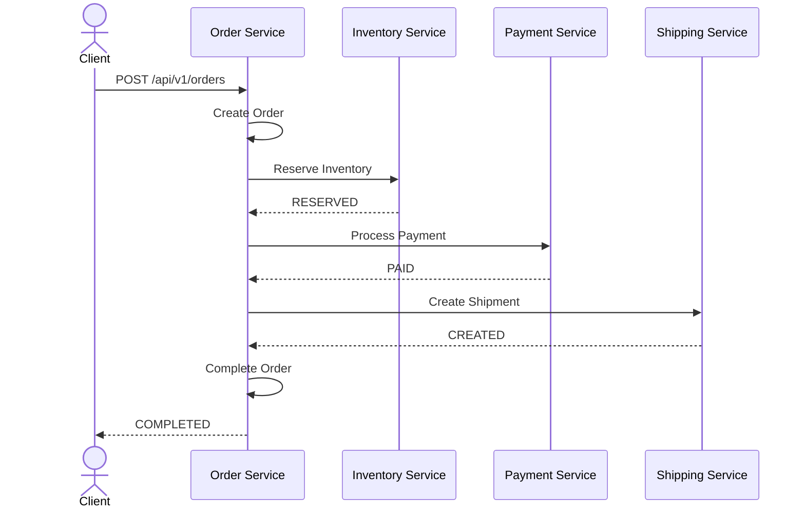
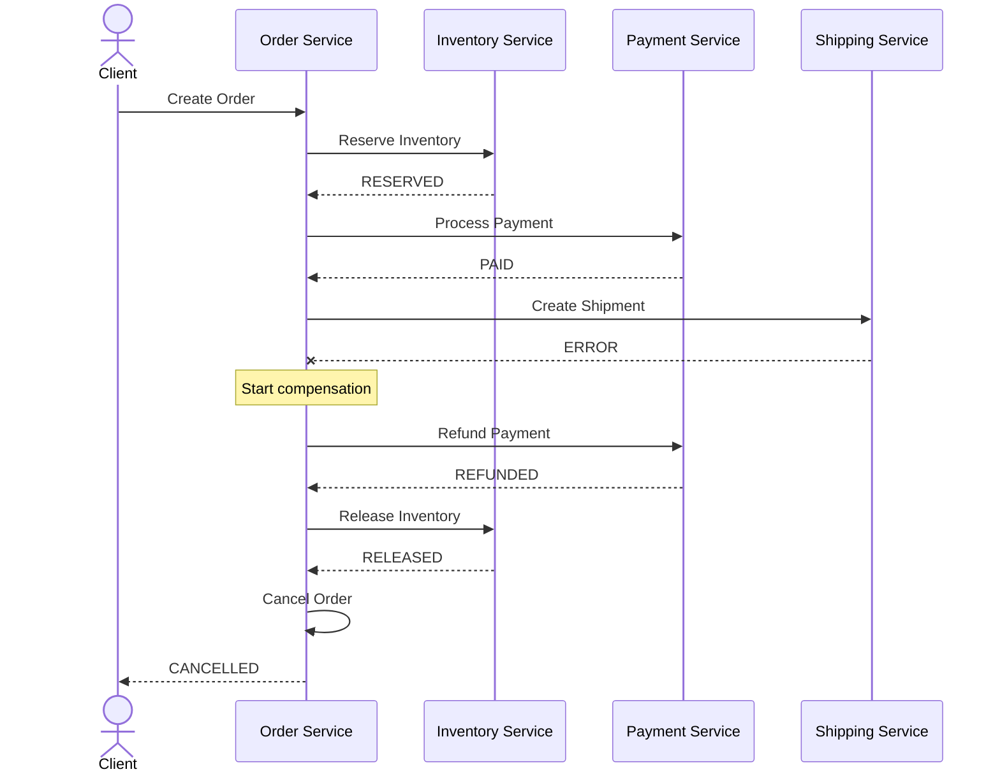

# Reactive Distributed Transactions Lab

> Hands-on implementation of distributed transaction patterns using **Java 21**, **Spring Boot**, **Spring WebFlux**, **Project Reactor**, **R2DBC**, **PostgreSQL** and the **Saga Pattern**.

## Overview

**Reactive Distributed Transactions Lab** is a hands-on laboratory designed to explore, implement and test distributed transaction patterns in a reactive microservices architecture.

The project starts with a synchronous **Saga Orchestration** implementation and progressively evolves toward a production-oriented architecture incorporating:

* Saga Orchestration
* Compensating Transactions
* Persistent Saga State
* Idempotency
* Retry and Timeout strategies
* Transactional Outbox
* Event-driven communication
* Saga Choreography
* Reactive persistence with R2DBC
* Integration testing with Testcontainers
* Observability
* Docker
* Kubernetes

The main goal is to understand how to maintain **business consistency across multiple microservices without relying on distributed ACID transactions or Two-Phase Commit (2PC)**.

---

# Architecture

The laboratory uses an e-commerce order processing scenario involving four independent microservices.

```text
reactive-distributed-transactions-lab/
│
├── order-service/
│
├── inventory-service/
│
├── payment-service/
│
├── shipping-service/
│
├── infrastructure/
│   ├── docker/
│   └── kubernetes/
│
├── docs/
│   ├── architecture/
│   ├── diagrams/
│   └── labs/
│
├── docker-compose.yml
├── build.gradle
├── settings.gradle
└── README.md
```

## Microservices

| Service             | Responsibility                          |   Port |
| ------------------- | --------------------------------------- | -----: |
| `order-service`     | Order management and Saga orchestration | `8080` |
| `inventory-service` | Inventory reservation and release       | `8081` |
| `payment-service`   | Payment processing and refunds          | `8082` |
| `shipping-service`  | Shipment creation and cancellation      | `8083` |

Initially, the `order-service` acts as the **Saga Orchestrator**.

Later stages of the laboratory introduce event-driven communication and Saga Choreography.

---

# Technology Stack

| Technology      | Purpose                    |
| --------------- | -------------------------- |
| Java 21         | Programming language       |
| Spring Boot 4.x | Application framework      |
| Spring WebFlux  | Reactive HTTP stack        |
| Project Reactor | Reactive programming       |
| R2DBC           | Reactive database access   |
| PostgreSQL      | Relational persistence     |
| Gradle          | Build system               |
| JUnit 5         | Unit testing               |
| Mockito         | Mocking                    |
| Reactor Test    | Reactive stream testing    |
| Testcontainers  | Integration testing        |
| Docker          | Local infrastructure       |
| Kafka           | Event-driven communication |
| Kubernetes      | Container orchestration    |

---

# Business Scenario

The laboratory simulates the creation of an e-commerce order.

A successful order requires the following operations:

```text
Create Order
     │
     ▼
Reserve Inventory
     │
     ▼
Process Payment
     │
     ▼
Create Shipment
     │
     ▼
Complete Order
```

Each operation belongs to an independent service and potentially an independent database.

Therefore, there is no single database transaction capable of atomically rolling back the complete business operation.

This is where the **Saga Pattern** is introduced.

---

# Saga Pattern

A Saga represents a distributed business transaction as a sequence of local transactions.

Each successful operation can define an associated **compensating transaction**.

| Operation         | Compensation      |
| ----------------- | ----------------- |
| Create Order      | Cancel Order      |
| Reserve Inventory | Release Inventory |
| Process Payment   | Refund Payment    |
| Create Shipment   | Cancel Shipment   |

Instead of performing a traditional distributed rollback, the system executes compensating business operations.

---

# Successful Saga

A successful transaction follows this sequence:



The resulting order status is:

```text
COMPLETED
```

---

# Compensation Scenario

Consider the following situation:

```text
Inventory Reservation    SUCCESS
Payment                  SUCCESS
Shipment                 FAILED
```

The Saga cannot perform a database rollback across the participating services.

Instead, it starts compensation.



Compensations are executed in the **reverse order** of the successfully completed operations.

```text
Execution

Inventory
   ↓
Payment
   ↓
Shipping
   ↓
ERROR


Compensation

Payment Refund
   ↓
Inventory Release
```

---

# Saga States

The Saga lifecycle is represented explicitly.

```java
public enum SagaStatus {

    STARTED,

    INVENTORY_RESERVED,

    PAYMENT_COMPLETED,

    SHIPMENT_CREATED,

    COMPLETED,

    COMPENSATING,

    COMPENSATED,

    COMPENSATION_FAILED,

    FAILED
}
```

A Saga instance can therefore represent exactly where a distributed transaction currently stands.

Example:

```text
Saga ID:
7430575a-43fc-4622-a1bd-61f2c50ec722

Order ID:
1276236f-c761-4417-a58f-c7fa93ddc520

Status:
PAYMENT_COMPLETED

Current Step:
CREATE_SHIPMENT
```

---

# Persistent Saga State

Saga execution state is persisted in PostgreSQL.

```sql
CREATE TABLE saga_instance
(
    saga_id UUID PRIMARY KEY,
    order_id UUID NOT NULL,
    saga_type VARCHAR(100) NOT NULL,
    status VARCHAR(50) NOT NULL,
    current_step VARCHAR(100),
    failure_reason VARCHAR(1000),
    created_at TIMESTAMP NOT NULL,
    updated_at TIMESTAMP NOT NULL
);
```

Indexes:

```sql
CREATE INDEX idx_saga_order
    ON saga_instance(order_id);

CREATE INDEX idx_saga_status
    ON saga_instance(status);
```

Persisting Saga state allows the system to recover unfinished transactions after application or infrastructure failures.

---

# Reactive Architecture

All services use Spring WebFlux and Project Reactor.

Operations must remain inside the reactive pipeline.

Correct:

```java
return inventoryGateway.reserve(order)
    .then(paymentGateway.pay(order))
    .then(shippingGateway.create(order));
```

Blocking operations must not be introduced into the reactive execution path.

Avoid:

```java
paymentGateway.pay(order).block();
```

Also avoid manually breaking the reactive chain:

```java
paymentGateway.pay(order).subscribe();
```

The use case should return the reactive publisher to its caller.

---

# Hexagonal Architecture

Each microservice follows Clean/Hexagonal Architecture principles.

```text
                    ┌─────────────────┐
                    │       API       │
                    │ Handler/Router  │
                    └────────┬────────┘
                             │
                             ▼
                    ┌─────────────────┐
                    │    Use Cases    │
                    └────────┬────────┘
                             │
                             ▼
                    ┌─────────────────┐
                    │     Domain      │
                    │ Models / Ports  │
                    └────────┬────────┘
                             │
              ┌──────────────┴──────────────┐
              ▼                             ▼
     ┌─────────────────┐           ┌─────────────────┐
     │ R2DBC Adapter   │           │ WebClient       │
     │ PostgreSQL      │           │ Adapter         │
     └─────────────────┘           └─────────────────┘
```

A typical module structure is:

```text
src/main/java/com/sagalab/
│
├── api/
│   ├── handler/
│   ├── router/
│   ├── dto/
│   └── mapper/
│
├── usecase/
│
├── model/
│   ├── order/
│   ├── saga/
│   └── gateway/
│
└── driven/
    ├── persistence/
    │   ├── adapter/
    │   ├── entity/
    │   ├── mapper/
    │   └── repository/
    │
    └── http/
        ├── adapter/
        ├── client/
        ├── dto/
        └── mapper/
```

The domain must not depend on infrastructure technologies such as:

* WebClient
* R2DBC
* PostgreSQL
* Kafka
* HTTP
* Spring Data repositories

Infrastructure depends on the domain contracts, not the other way around.

---

# Saga Orchestrator

The initial implementation uses **Saga Orchestration**.

```text
                    Client
                       │
                       ▼
               ┌───────────────┐
               │ Order Service │
               │               │
               │     Saga      │
               │ Orchestrator  │
               └───────┬───────┘
                       │
           ┌───────────┼───────────┐
           │           │           │
           ▼           ▼           ▼
      Inventory     Payment     Shipping
       Service      Service      Service
```

The orchestrator determines:

* which step executes next;
* which steps completed successfully;
* when compensation must begin;
* which compensations must execute;
* the order of compensations;
* the final Saga status.

---

# Saga Engine

As the laboratory evolves, the orchestration logic will be generalized into a reactive Saga Engine.

The target API will resemble:

```java
SagaDefinition<CreateOrderContext>
    .step("RESERVE_INVENTORY")
        .action(inventory::reserve)
        .compensation(inventory::release)

    .step("PROCESS_PAYMENT")
        .action(payment::pay)
        .compensation(payment::refund)

    .step("CREATE_SHIPMENT")
        .action(shipping::create)
        .compensation(shipping::cancel);
```

Conceptually:

```text
START SAGA
    │
    ▼
Execute Step
    │
    ▼
Persist Result
    │
    ▼
Next Step
    │
    ├──────── SUCCESS ────────► Continue
    │
    └──────── ERROR
                 │
                 ▼
          COMPENSATING
                 │
                 ▼
       Load Completed Steps
                 │
                 ▼
           Reverse Order
                 │
                 ▼
       Execute Compensations
                 │
          ┌──────┴──────┐
          ▼             ▼
        SUCCESS        ERROR
          │             │
          ▼             ▼
     COMPENSATED   COMPENSATION_FAILED
```

---

# TDD Strategy

The laboratory follows a test-first approach.

Before implementing each Saga behavior, its expected result is represented as a test.

The primary scenarios are:

| Scenario              | Inventory | Payment | Shipping | Expected result       |
| --------------------- | --------- | ------- | -------- | --------------------- |
| Happy Path            | OK        | OK      | OK       | `COMPLETED`           |
| Inventory unavailable | ERROR     | —       | —        | `CANCELLED`           |
| Payment rejected      | OK        | ERROR   | —        | Release inventory     |
| Shipping failure      | OK        | OK      | ERROR    | Refund + release      |
| Refund failure        | OK        | OK      | ERROR    | `COMPENSATION_FAILED` |
| Payment timeout       | OK        | TIMEOUT | —        | Compensation          |
| Duplicate request     | —         | —       | —        | Idempotent response   |
| Pod restart           | OK        | OK      | Pending  | Saga recovery         |

Reactive flows are tested using `StepVerifier`.

Example:

```java
StepVerifier.create(useCase.execute(command))
    .assertNext(order ->
        assertThat(order.status())
            .isEqualTo(OrderStatus.COMPLETED)
    )
    .verifyComplete();
```

Compensation order is also verified.

```java
InOrder compensationOrder = inOrder(
    paymentGateway,
    inventoryGateway
);

compensationOrder
    .verify(paymentGateway)
    .refund(order);

compensationOrder
    .verify(inventoryGateway)
    .release(order);
```

---

# Idempotency

Distributed systems must assume that requests and events can be delivered more than once.

The laboratory will therefore introduce an idempotency mechanism.

Example request:

```http
POST /api/v1/orders
Idempotency-Key: ORD-REQUEST-000001
```

Repeated execution using the same key must not:

```text
Reserve inventory twice
Charge the customer twice
Create multiple shipments
Execute compensation twice
```

Idempotency will eventually be applied to both forward and compensating operations.

---

# Transactional Outbox

The Saga implementation will later introduce the **Transactional Outbox Pattern**.

Instead of performing:

```text
Save Order
     ↓
Publish Event
```

as two unrelated operations, the business state and event are persisted atomically in the same local database transaction.

```text
               PostgreSQL
                    │
          ┌─────────┴─────────┐
          │                   │
       Orders              Outbox
          │                   │
          └──── Local TX ─────┘
                              │
                              ▼
                         Publisher
                              │
                              ▼
                            Kafka
```

This prevents inconsistencies such as:

```text
Order persisted
       +
Application crashes
       +
Event never published
```

---

# Saga Orchestration vs Choreography

The laboratory initially uses orchestration.

Later, the same business process will be implemented using choreography.

### Orchestration

```text
             Saga Orchestrator
             /       |       \
            /        |        \
           ▼         ▼         ▼
     Inventory    Payment    Shipping
```

Advantages include centralized workflow visibility and explicit compensation control.

### Choreography

```text
OrderCreated
     │
     ▼
Inventory
     │
InventoryReserved
     │
     ▼
Payment
     │
PaymentCompleted
     │
     ▼
Shipping
```

Services react to domain events without a central process coordinator.

Implementing both approaches allows their operational and architectural trade-offs to be evaluated using the same business scenario.

---

# Failure Scenarios

Failure injection is an important part of this laboratory.

The services will support controlled failure scenarios such as:

```text
PAYMENT_REJECTED
PAYMENT_TIMEOUT
INVENTORY_UNAVAILABLE
SHIPPING_UNAVAILABLE
REFUND_FAILED
DATABASE_UNAVAILABLE
SERVICE_UNAVAILABLE
```

This allows deterministic testing of Saga behavior.

For example:

```text
POST /api/v1/orders
        │
        ▼
Inventory OK
        │
        ▼
Payment OK
        │
        ▼
Shipping ERROR
        │
        ▼
Refund
        │
        ▼
Release Inventory
        │
        ▼
CANCELLED
```

---

# Resilience

Later stages introduce resilience policies for remote operations.

The laboratory will evaluate:

* Connection timeout
* Response timeout
* Retry
* Exponential backoff
* Circuit Breaker
* Bulkhead
* Idempotent retries

Retries must be applied carefully.

For example, blindly retrying:

```text
POST /payments
```

could result in multiple charges unless the payment operation is idempotent.

---

# Observability

Every Saga will have a unique identifier.

Example:

```text
sagaId=7430575a-43fc-4622-a1bd-61f2c50ec722
orderId=1276236f-c761-4417-a58f-c7fa93ddc520
correlationId=f67f68af-a429-4fb4-a91d-c129bc384231
```

These identifiers will propagate across participating services.

Target log:

```text
[SAGA][STARTED]
sagaId=7430575a
orderId=1276236f

[SAGA][STEP]
step=RESERVE_INVENTORY
status=SUCCESS

[SAGA][STEP]
step=PROCESS_PAYMENT
status=SUCCESS

[SAGA][STEP]
step=CREATE_SHIPMENT
status=FAILED

[SAGA][COMPENSATION]
step=REFUND_PAYMENT
status=SUCCESS

[SAGA][COMPENSATION]
step=RELEASE_INVENTORY
status=SUCCESS

[SAGA][COMPENSATED]
sagaId=7430575a
```

Future iterations will introduce metrics and distributed tracing.

---

# Laboratory Roadmap

The project is developed incrementally.

```text
Phase 01
Project structure
      │
      ▼
Phase 02
Reactive microservices
      │
      ▼
Phase 03
Saga Orchestration
      │
      ▼
Phase 04
Compensating Transactions
      │
      ▼
Phase 05
Persistent Saga State
      │
      ▼
Phase 06
Generic Reactive Saga Engine
      │
      ▼
Phase 07
Idempotency
      │
      ▼
Phase 08
Timeout / Retry / Circuit Breaker
      │
      ▼
Phase 09
Transactional Outbox
      │
      ▼
Phase 10
Kafka
      │
      ▼
Phase 11
Saga Choreography
      │
      ▼
Phase 12
Testcontainers
      │
      ▼
Phase 13
Observability
      │
      ▼
Phase 14
Docker
      │
      ▼
Phase 15
Kubernetes
```

---

# Learning Objectives

At the end of the laboratory, the developer should be able to explain and implement:

1. Why a local database transaction cannot guarantee consistency across independent microservices.
2. Why distributed transactions are difficult in microservice architectures.
3. How the Saga Pattern addresses distributed business consistency.
4. The difference between technical rollback and business compensation.
5. Saga Orchestration.
6. Saga Choreography.
7. Persistent Saga state.
8. Compensation ordering.
9. Compensation failure handling.
10. Idempotent operations.
11. Reactive transaction management.
12. Transactional Outbox.
13. Event-driven consistency.
14. Saga recovery after application failure.
15. Testing distributed failure scenarios.
16. Observability for distributed business transactions.

---

# Important Principle

A Saga does not provide traditional ACID rollback across multiple services.

Instead:

> **A Saga maintains business consistency by coordinating local transactions and executing compensating actions when the distributed workflow cannot be completed.**

This distinction is fundamental.

```text
Database Transaction

BEGIN
  operation A
  operation B
  operation C
ROLLBACK


Distributed Saga

Operation A ── SUCCESS
Operation B ── SUCCESS
Operation C ── ERROR
                   │
                   ▼
Compensate B
                   │
                   ▼
Compensate A
```

---

# Current Status

Current laboratory stage:

```text
[✓] Architecture definition
[✓] Business scenario
[✓] Saga states
[✓] Domain contracts
[✓] Initial TDD scenarios
[✓] Compensation design

[ ] Multi-module Gradle project
[ ] Order Service
[ ] Inventory Service
[ ] Payment Service
[ ] Shipping Service
[ ] PostgreSQL persistence
[ ] Persistent Saga State
[ ] Generic Saga Engine
[ ] Idempotency
[ ] Transactional Outbox
[ ] Kafka
[ ] Choreography
[ ] Testcontainers
[ ] Observability
[ ] Docker Compose
[ ] Kubernetes
```

---

# Project

**Reactive Distributed Transactions Lab**

A practical laboratory for studying distributed consistency, reactive microservices and Saga-based transaction management with Spring WebFlux.

---

## Author

**Raul Bolivar**

---

## License

This project is intended for educational, architectural experimentation and distributed systems training purposes.
