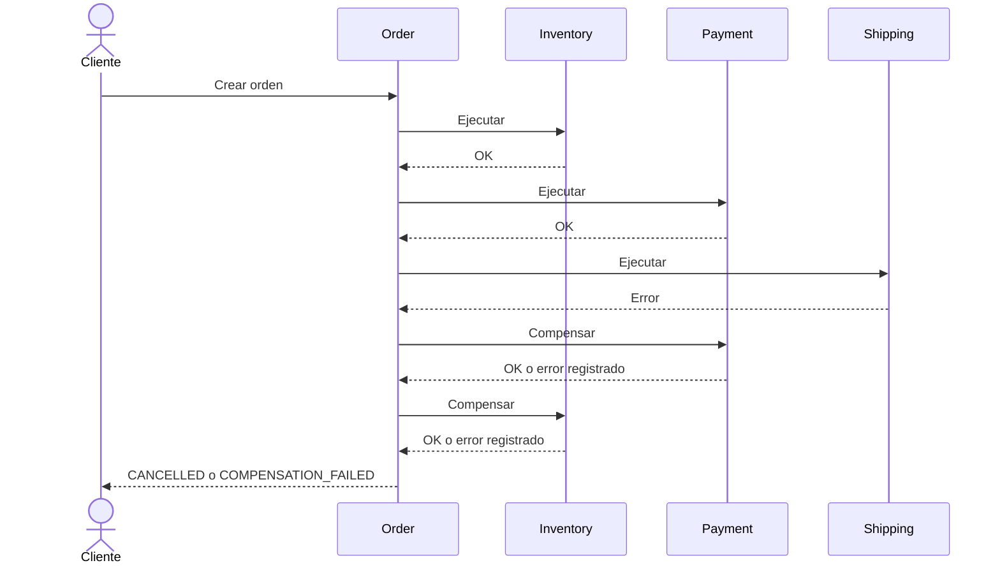
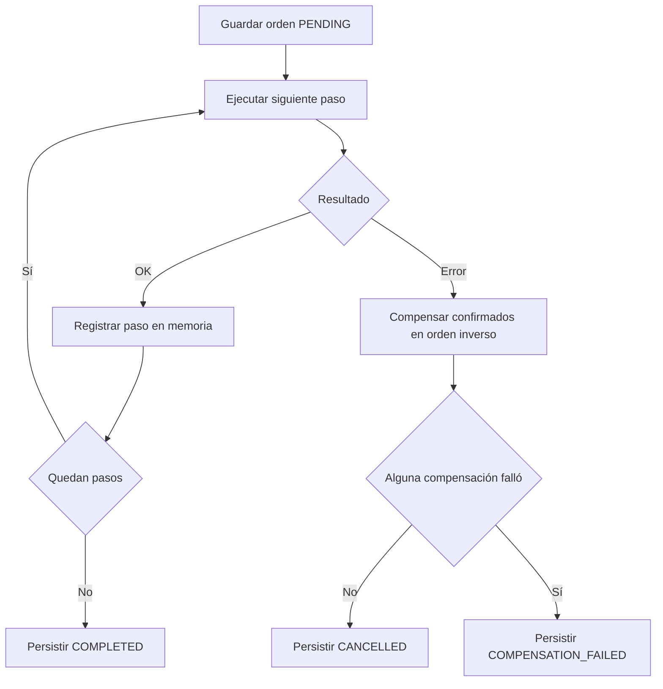

# Reactive Distributed Transactions Lab

**Incremento 01 — Saga orquestada con compensaciones reactivas.** Autor: Raul Bolivar.

Java 21 · Spring Boot 4.1.1 · Gradle 9 · WebFlux · R2DBC · PostgreSQL.

## Alcance implementado

Cuatro aplicaciones independientes, puertos 8080–8083, con modelo, puertos, casos de uso, API HTTP y adaptadores PostgreSQL. Order coordina Inventory, Payment y Shipping con WebClient. Los participantes simulan operaciones de negocio y guardan su estado; no procesan pagos reales ni calculan disponibilidad de stock. Cada servicio tiene su propia base de datos en una instancia PostgreSQL para el laboratorio.

El orquestador compensa únicamente las acciones confirmadas, en orden inverso. Intenta las compensaciones restantes aunque alguna falle. Persiste la orden inicial y su resultado terminal. Siete pruebas verifican ejecución, orden y ausencia de compensaciones duplicadas.

**Pendiente:** estado durable por paso, recuperación, idempotencia robusta, conciliación de resultados ambiguos, timeout/retry, migraciones versionadas, Outbox, Kafka, Testcontainers y Kubernetes. Este incremento no recupera una Saga interrumpida. Una respuesta HTTP perdida puede ocultar una operación remota exitosa; se resolverá con idempotencia y conciliación en otro incremento. Las tablas se inicializan mediante SQL idempotente de Spring, sin JDBC en la aplicación.

## Ejecutar con Docker

Requisitos: Docker Desktop con Compose y acceso a Maven Central/Gradle durante la compilación.

```bash
docker compose up --build -d
docker compose logs -f order-service
```

Espera hasta que los cuatro `/actuator/health` respondan antes de probar. Compose espera PostgreSQL; el inicio del contenedor de un participante no garantiza su disponibilidad HTTP.

```bash
curl http://localhost:8080/actuator/health
curl http://localhost:8081/actuator/health
curl http://localhost:8082/actuator/health
curl http://localhost:8083/actuator/health
```

## IntelliJ / ejecución local

Abre `settings.gradle`, selecciona JDK 21 y Gradle 9.0.0. Si el Wrapper está incluido, selecciona Wrapper. Inicia PostgreSQL:

```bash
docker compose up -d postgres
./gradlew test
./gradlew :inventory-service:bootRun
./gradlew :payment-service:bootRun
./gradlew :shipping-service:bootRun
./gradlew :order-service:bootRun
```

Ejecuta cada `bootRun` en una terminal independiente. En Windows usa `gradlew.bat` si está disponible o `gradle` instalado. Puedes ejecutar también las cuatro clases `Application` desde IntelliJ.

## Crear y consultar una orden

```bash
curl -X POST http://localhost:8080/api/v1/orders -H 'Content-Type: application/json' -d '{"customerId":"CUS-001","productId":"PROD-001","quantity":2,"amount":150.00,"scenario":"NONE"}'
curl http://localhost:8080/api/v1/orders/REEMPLAZAR_UUID
```

La creación responde HTTP 201 con `orderId`, `sagaId`, `command`, `status` y `failureReason`; una Saga compensada también crea una orden y devuelve 201 con su estado terminal. GET devuelve 404 si no existe.

| scenario | Resultado | Compensación |
|---|---|---|
| NONE | COMPLETED | Ninguna |
| INVENTORY_UNAVAILABLE | CANCELLED | Ninguna |
| PAYMENT_REJECTED | CANCELLED | Inventory |
| SHIPPING_UNAVAILABLE | CANCELLED | Payment, Inventory |
| REFUND_FAILED | COMPENSATION_FAILED | Refund falla; Inventory se libera |
| RELEASE_FAILED | COMPENSATION_FAILED | Refund OK; release falla |

El campo `scenario` es una herramienta de inyección de fallos del laboratorio.

## Inspeccionar PostgreSQL

```bash
docker compose exec postgres psql -U sagalab -d order -c 'SELECT id,status,failure_reason FROM orders;'
docker compose exec postgres psql -U sagalab -d payment -c 'SELECT * FROM operations;'
docker compose exec postgres psql -U sagalab -d inventory -c 'SELECT * FROM operations;'
```

`docker compose down` conserva los datos. Las credenciales locales son `sagalab/sagalab`. Puerto 5432 debe estar libre. Cambia puertos/credenciales si tu PostgreSQL existente usa los mismos; el script init solo corre sobre un volumen nuevo.

## Secuencia de compensación



## Flujo del motor inicial



## TDD

Consulta `docs/labs/01-tdd.md`. Las pruebas son ejecutables; el ZIP contiene el resultado final, no un historial ficticio de ciclos rojo/verde.

Referencia de compatibilidad: https://docs.spring.io/spring-boot/system-requirements.html
